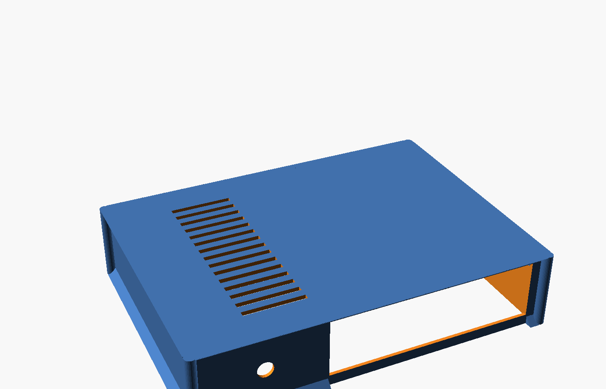

# Thin mATX PicoPSU Case

A fully parametric, 3D-printable case for a micro-ATX motherboard (originally
designed around an ASUS H81M-C), a PicoPSU, and a low-profile CPU cooler —
no expansion cards, as thin as the I/O shield allows.



Written as a single [OpenSCAD](https://openscad.org/) file. Every dimension —
board size, wall thickness, I/O shield position, standoff pins, vents, front
panel holes — is a named variable near the top of `case.scad`, so it can be
re-fit to a different board without touching the geometry logic.

## What's included

- **Base tray** — perimeter ledge (widened on one side to match a real
  fit-check), retention tabs, standoff pins across the floor, chamfered
  underside/topside flanges (prints with no supports), rear I/O cutout,
  front DC jack hole, rear power-switch hole, optional floor vents (hex or
  slit style).
- **Lid** — vented, corners rounded to match the screw-post radius.
- **I/O opening test coupon** — a small flat frame with just the I/O cutout,
  for a fast test print before committing to the full tray.
- **Ledge fit test coupon** — a small corner sample (wall + ledge + chamfer +
  retention tab) to test-fit a real board corner before a full print.

Pre-generated STLs for all four are in [`stl/`](stl/). They match whatever
`case.scad` currently contains — regenerate them (see below) after changing
any parameter.

## Printing

Open `case.scad` in OpenSCAD and use the **Customizer** panel (Window menu →
Customizer) to check exactly one of these boxes, then **F6** (Render) →
**File → Export → Export as STL**:

- `show_base`
- `show_lid`
- `show_io_test`
- `show_ledge_test`

Or from the command line:

```sh
openscad -D 'part="base"'       -o base.stl        case.scad
openscad -D 'part="lid"'        -o lid.stl          case.scad
openscad -D 'part="io_test"'    -o io_test.stl      case.scad
openscad -D 'part="ledge_test"' -o ledge_test.stl   case.scad
```

All pieces are oriented to print flat with no supports.

## Fitting to your own board

Everything is driven by named variables at the top of `case.scad`:

| Section | Covers |
|---|---|
| Board dimensions | `board_w`, `board_d`, `board_t`, `gap` |
| Case shell | `wall`, `standoff_h`, `top_clear`, `floor_t`, `lid_t` |
| I/O shield | `shield_w`, `shield_h`, `io_margin_left/right/top/bottom`, `shield_offset_from_board_left`, `rim_above` |
| Ledge / board retention | `ledge_w`, `ledge_w_left`, `ledge_t`, `board_clearance`, `tab_h` |
| Standoff pins | `add_standoff_pins`, `pin_d`, `pin_h`, `pin_pitch`, `pin_margin` |
| Floor vents | `floor_vents`, `floor_vent_style` ("hex"/"slit"), margins, size/pitch |
| Front/rear panel holes | `dc_jack_d/x/z`, `pwr_btn_d/x/z` |
| Corner posts / lid | `ear`, `post_d` |

Re-measure your board's I/O shield position the same way this one was
calibrated: lay a ruler along the rear edge and down the shield height in a
couple of photos, then adjust `shield_offset_from_board_left` and the
`io_margin_*` values to match.

## License

GPL-3.0 — see [LICENSE](LICENSE).
